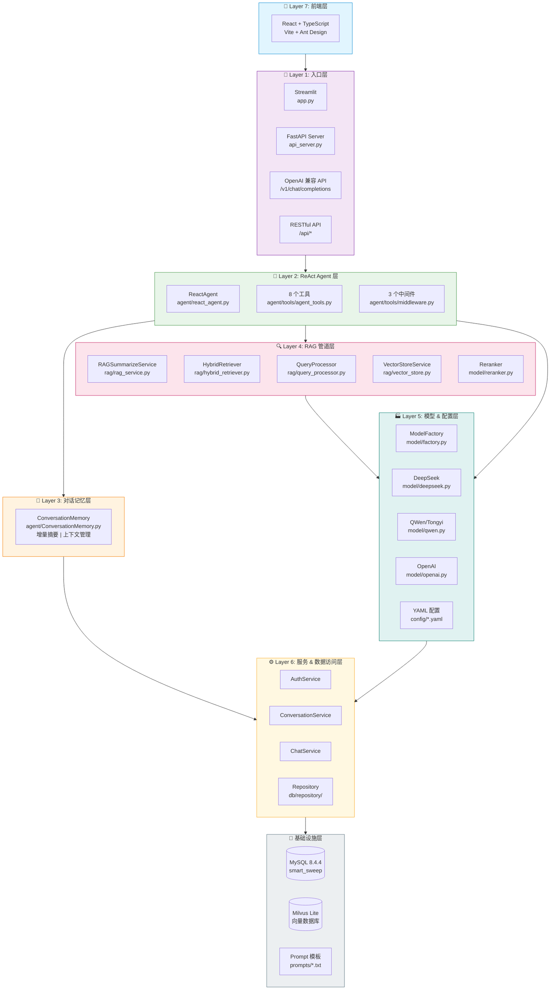
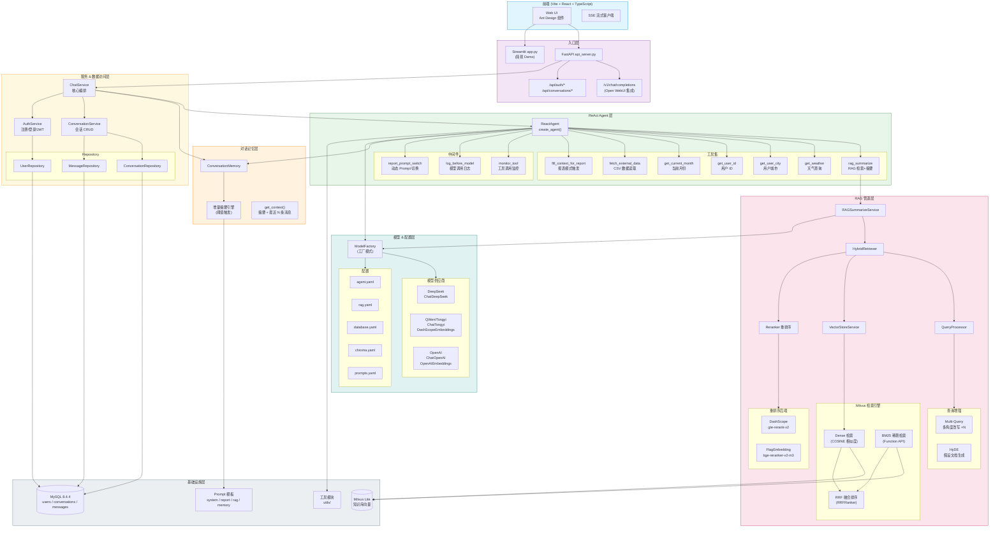
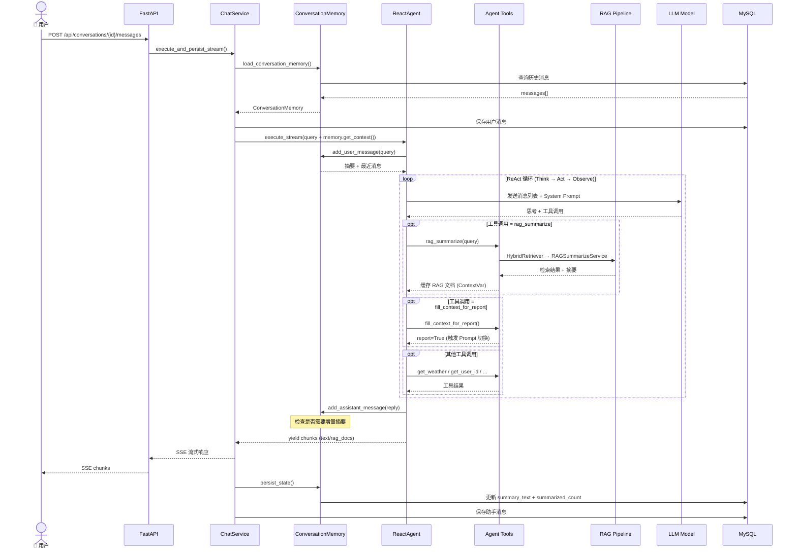
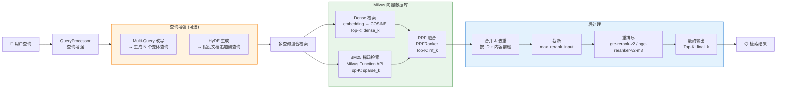
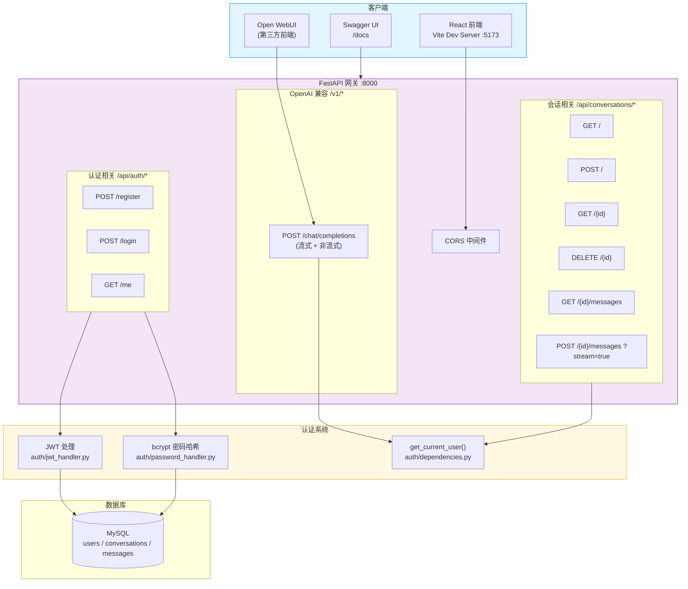
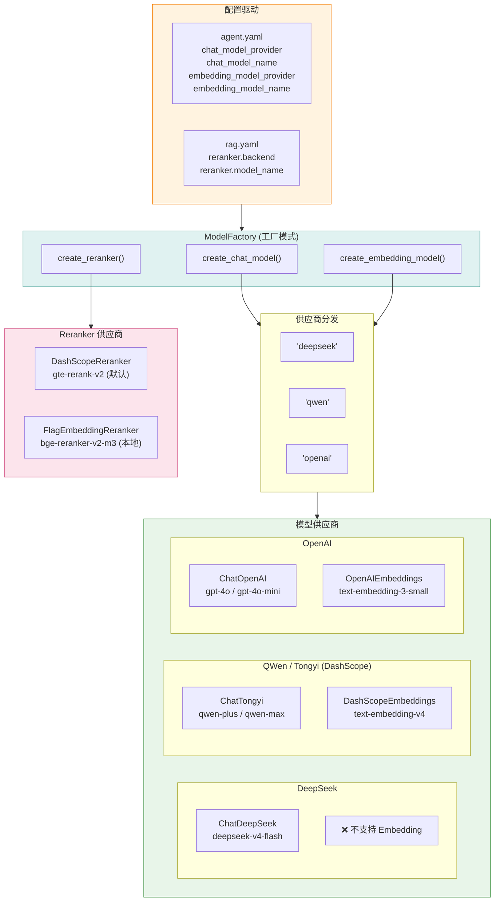
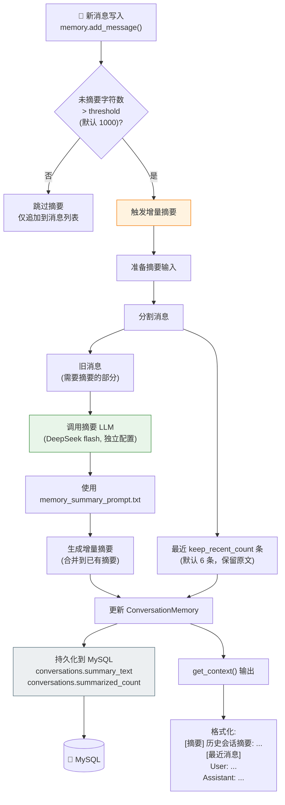

# 智扫通 (Smart Sweep) 系统架构图

> 智能扫地机器人客服系统 — 基于 LangChain/LangGraph ReAct Agent 的多层架构

---

## 一、总体分层架构



---

## 二、完整部件架构图



---

## 三、ReAct Agent 执行流程



---

## 四、RAG 混合检索管道详解



---

## 五、API 与认证架构



---

## 六、多模型供应商架构



---

## 七、对话记忆增量摘要流程



---

## 八、项目目录结构

```
Agent项目实战/
├── app.py                    # Streamlit 简易 Demo
├── api_server.py             # FastAPI 主入口 (OpenAI 兼容 + RESTful)
├── __init__.py
├── CLAUDE.md                 # 项目 AI 助手指南
├── TODO.md                   # 待办事项
│
├── agent/                    # 🤖 ReAct Agent 层
│   ├── react_agent.py        #   ReactAgent (基于 LangChain create_agent)
│   ├── ConversationMemory.py #   对话记忆 (增量摘要 + 上下文管理)
│   └── tools/
│       ├── agent_tools.py    #   8 个工具函数
│       └── middleware.py     #   3 个中间件 (监控/日志/Prompt切换)
│
├── rag/                      # 🔍 RAG 管道层
│   ├── rag_service.py        #   RAGSummarizeService (检索+摘要+LLM)
│   ├── hybrid_retriever.py   #   HybridRetriever (混合检索编排)
│   ├── query_processor.py    #   QueryProcessor (Multi-Query / HyDE)
│   ├── vector_store.py       #   VectorStoreService (Milvus 管理)
│   └── reranker.py           #   (已迁移至 model/reranker.py)
│
├── model/                    # 🏭 模型 & 配置层
│   ├── factory.py            #   ModelFactory (工厂模式统一入口)
│   ├── deepseek.py           #   DeepSeek Chat (ChatDeepSeek)
│   ├── qwen.py               #   QWen Chat + Embeddings (DashScope)
│   ├── openai.py             #   OpenAI Chat + Embeddings
│   └── reranker.py           #   Reranker (DashScope / FlagEmbedding)
│
├── services/                 # ⚙️ 服务编排层
│   ├── chat_service.py       #   ChatService (核心编排)
│   ├── conversation_service.py # ConversationService (会话 CRUD)
│   └── auth_service.py       #   AuthService (注册/登录)
│
├── db/                       # 💾 数据访问层
│   ├── connection.py         #   SQLAlchemy 引擎 + 连接池
│   ├── base.py               #   ORM Base 类
│   ├── models/               #   ORM 模型 (User, Conversation, Message)
│   └── repository/           #   Repository 模式
│
├── auth/                     # 🔐 认证模块
│   ├── jwt_handler.py        #   JWT 创建/验证
│   ├── password_handler.py   #   bcrypt 密码哈希
│   └── dependencies.py       #   FastAPI get_current_user() 依赖
│
├── schemas/                  # 📋 Pydantic 数据模型
│   ├── auth_schemas.py       #   认证请求/响应
│   ├── conversation_schemas.py # 会话请求/响应
│   └── message_schemas.py    #   消息请求/响应
│
├── config/                   # ⚙️ YAML 配置文件
│   ├── agent.yaml            #   模型供应商/名称 + 记忆参数
│   ├── rag.yaml              #   Milvus + 混合检索 + HyDE + Reranker
│   ├── database.yaml         #   MySQL 连接 + JWT 配置
│   ├── chroma.yaml           #   向量库分块参数 (兼容)
│   └── prompts.yaml          #   Prompt 文件路径
│
├── prompts/                  # 📝 Prompt 模板
│   ├── system_prompt.txt     #   Agent 系统提示词
│   ├── report_prompt.txt     #   报表生成提示词
│   ├── rag_summarize_prompt.txt # RAG 摘要提示词
│   └── memory_summary_prompt.txt # 记忆摘要提示词
│
├── utils/                    # 🛠 工具模块
│   ├── path_tool.py          #   路径解析
│   ├── config_handler.py     #   YAML 配置加载
│   ├── prompt_loader.py      #   Prompt 文件读取
│   └── logger_handler.py     #   日志管理
│
├── eval/                     # 📊 评估
│   └── rag_eval.py           #   RAGAS 评估管道
│
├── frontend/                 # 🎨 前端
│   └── src/                  #   React + TypeScript + Vite + Ant Design
│
├── scripts/                  # 🔧 工具脚本
│   ├── manage_kb.py          #   知识库管理
│   ├── rebuild_kb.py         #   BM25 重建
│   └── test_chat_*.py        #   API 测试
│
├── data/                     # 📄 知识库源文件 (.txt/.pdf)
├── milvus.db/                # 🗄 Milvus Lite 向量存储
├── logs/                     # 📜 日志文件
└── 系统架构图/                # 🖼 架构图
    └── 系统架构图.md
```

---

## 九、关键技术栈

| 层级 | 技术选型 |
|------|----------|
| **前端** | React 18, TypeScript, Vite, Ant Design |
| **API 网关** | FastAPI, SSE 流式, CORS |
| **Agent 框架** | LangChain, LangGraph `create_agent()`, ReAct 模式 |
| **对话记忆** | 增量摘要 + 上下文窗口 (Pydantic BaseModel) |
| **RAG 检索** | Milvus Lite, Dense (COSINE) + BM25 + RRF 融合 |
| **查询增强** | Multi-Query 改写 + HyDE 假设文档生成 |
| **重排序** | DashScope gte-rerank-v2 / FlagEmbedding bge-reranker-v2-m3 |
| **LLM 模型** | DeepSeek (默认), QWen/Tongyi, OpenAI (工厂模式) |
| **Embedding** | DashScope text-embedding-v4 (默认) |
| **关系数据库** | MySQL 8.4.4, SQLAlchemy ORM |
| **认证** | JWT + bcrypt (python-jose) |
| **配置** | YAML 驱动 (agent / rag / database / chroma / prompts) |
| **日志** | 自定义 Logger (控制台 + 文件) |
| **评估** | RAGAS (easy/middle/hard 数据集) |
| **部署** | Windows (.bat 脚本), pip 依赖管理 |
```

